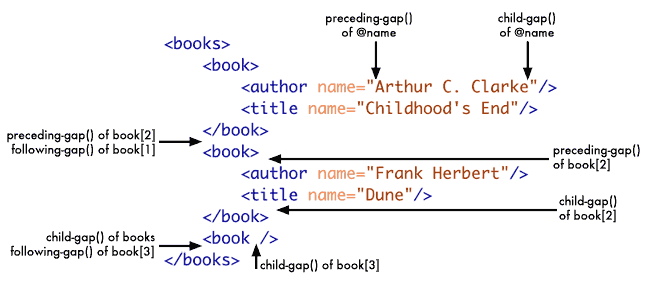

##About
Natural Views for Joomla.
Also includes other core bits, like com_composite.

##Description
The Natural Library provides two additional functionalities to Joomla!
* Natural Views
* Composite Component

##Copyright
Copyright ©2013-2014 Red Snapper Ltd. All rights reserved.
Much of Ace Editor Copyright ©2012 Sven Bluege. All rights reserved.

##License
GNU/GPLv2
http://www.gnu.org/licenses/gpl-2.0.html

##How to Install
Use the following line in Joomla "Install from URL"
https://raw.githubusercontent.com/RedSnapper/Natural/master/pkg_natural.zip

###About Natural Views.
Natural views are a means of being able to separate php from html completely.
The mechanism used is xpaths. In order to support this fully, certain aspects of Joomla's normal encoding mechanism have had to be changed (there is full backward compatibility however, so this only applies to natural view instances).

To try using the Natural Views, separate the view part of the code, and put it into it's own file, using the suffix xhtml. It must be valid XHTML 5.
Within the original (adjacent) php file, if this is an instance of JDocumentHTML (such as index.php in a template), then the xhtml view will be available as $this->nv; Otherwise one will need to instantiate the view object, by invoking it with:
````$nv=new NView();````
One can also instantiate an NView with other files (by using the filename)
````$nv=new NView('specific.xhtml');````
or an existing DOMDocument, DOMElement, or even a (valid) string of xhtml.
````$nv=new NView('<html>...</html>');````
One can also use clone to copy NViews.
````$ni=clone $nv;````

NView has three primary functions: get(),set() and show()

In general, when using xpaths with NView, it is important to know that the prefix h: is tied to the namespace http://www.w3.org/1999/xhtml

####set($xpath,$value = null,$ref = null)
eg. the following sets the class of all odd li elements to 'odd'.
````$nv->set('//h:li[position() mod 2 = 1]/@class','odd');````

####get($xpath, $ref = null)
This function will return either a DOMNodeList (if there is more than one result), or it will return the object itself (if there is just one result).

eg. the following returns the class of the first li element in the document.
````$class = $nv->get('(//h:li)[1]/@class');````

One may use a returned element as a reference for a subsequent get or set.
E.g:

```
//each data-next-class will hold the class of the following li.
$llist=$nv->get('//h:ul[@class='main']/h:li');
if ($llist instanceof DOMNodeList)
{
	$next = null;
	for( $pos=$llist->length - 1; $pos >= 0 ; $pos-- )
	{
		$ref = $llist->item($pos);
		if (!is_null($next))
		{
			$nv->set('./@data-next-class',$next,$ref);
		}
		$next = $nv->get('./@class',$ref);
	}
}
```

####Other functions
consume() is syntactic sugar. It deletes the addressed node(s) from the source document. It is very useful for grabbing an li as an item template.
It is functionally equivalent to:
'''
$a=$nv->get($xpath,$ref); 	//get the result
$nv->set($xpath,null,$ref); //delete from source
'''

####show($asdocument = false);
show() returns the view as a string, with the option of including the namespace, doctype and xml prolog (which by default it will not).

```
$xv= new NView('<!DOCTYPE head><head><title>title</title></head>');
$xv->set('//h:title/text()','Hello World');
$xv->show(false);

==> '<head><title>Hello World</title></head>'
```

####Natural Views extend xpath with gaps!!
The gap is probably the most significantly useful aspect of Natural. It allows for the coder to insert nodes - something that xpath itelf cannot do (as there is no ability with XPath to address gaps or insertion points). There are ways of doing this using DOM functions, but the point of this library is to make the view accessible without having to learn the DOM api.

There are three gap extensions: child-gap(), preceding-gap(), following-gap().

The easiest way to see how they differ is to examine the following image



###Natural Modules.
The Natural module is made up of two textareas - the Control component, and the View component. It works just as above, with $nv pointing to the view component.
One should not use show() in the module, as this is done by the containing code.

There are two other variables available to the control component:
$a is an array of module attributes.
$p is the set of module parameters.

Modules may be invoked directly within the view component, by using the following markup. ANY element may be used, not just divs.

`<div data-jmod="(module Type)" title="(module Title)" style="(module Style)" data-foo="Foo" data-bar="Bar"></div>`

(module Type) should be the name of a module type, eg. 'Menu' or 'Natural'.
(module Title) should be the title of the module to be placed here.
foo and bar will be available in $a, for instance ```$a['foo']=>'Foo'```;

There is no protection against self-referencing modules - so beware it's not that hard to create an infinite recursive loop!

###Composite Component
This is an aggregate component, which turns a menu into a rendered aggregate of it's contained menu-items. A composite menu-item may itself be in a menu which is the object of a composite menu-item - effectively providing HMVC.

There is no protection against self-referencing composites - so beware it's not that hard to create an infinite recursive loop!

##DEVELOPER NOTE: GIT REPO
The following will automatically package anything that needs packaging.
What it won't do is generate a new line in the update.xml file.

```
mkdir -p .git/hooks
cp git_hooks_pre_commit .git/hooks/pre-commit
chmod 777 .git/hooks/pre-commit
```

